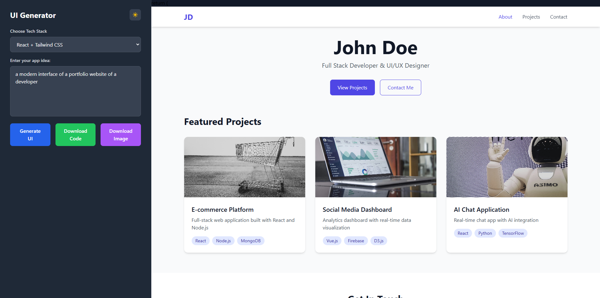

# UI Design Generator

This project is a web application that generates beautiful, modern UI designs based on user-provided app ideas using AI services.

## Description

The UI Design Generator allows users to input their app ideas and receive generated UI code in various tech stacks, including React with Tailwind CSS. The application leverages AI to create responsive and production-ready code.



## Features

- Generate complete HTML/CSS/JS code from text descriptions
- Supports multiple tech stacks (React, HTML, etc.)
- Customizable style preferences using Tailwind CSS
- Responsive design out of the box
- Dark mode support
- Downloadable code and images of the generated UI

## Installation

To set up the project locally, follow these steps:

1. Clone the repository:
   ```bash
   git clone <repository-url>
   cd idea_to_ui
   ```

2. Install the necessary dependencies:
   ```bash
   pip install -r requirements.txt
   ```

3. Set up environment variables:
   Create a `.env` file in the root directory and add your API keys:
   ```bash
   ANTHROPIC_API_KEY=your-key
   ```

## Usage

### Running the Application

To start the application, run:
```bash
python -m uvicorn app.main:app --reload
```

### Generating UI
1. Access the web application in your browser (default: `http://localhost:8000`).
2. Enter your app idea in the provided input field.
3. Select your desired tech stack.
4. Click the "Generate UI" button.
5. Use the "Download Code" button to download the generated code.
6. Use the "Download Image" button to capture the UI preview as an image.

## Swagger API Documentation

The application provides an interactive API documentation interface using Swagger. You can access it by navigating to:

```
http://localhost:8000/docs
```

### Available Endpoints


- **POST /generate-ui**: Generates UI code based on the provided app idea and style preferences.
  - **Request Body**:
    ```json
    {
        "prompt": "A modern landing page for a fitness app",
        "claude_api_key": "your-api-key",
        "style_preferences": {
            "colorScheme": "light",
            "style": "minimal"
        }
    }
    ```
  - **Response**: Returns the generated HTML/CSS/JS code.

- **GET /health**: Checks the health status of the API.
  - **Response**: Returns a simple JSON object indicating the API is running.

Make sure the application is running before accessing the Swagger UI.

## Contributing

Contributions are welcome! If you have suggestions or improvements, please submit a pull request or open an issue.

## License

This project is licensed under the MIT License.
